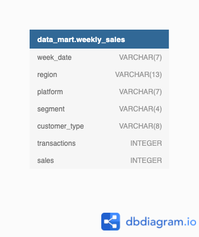

# Data Mart

_Challenge #5 from 8 Week SQL Challenge_

# 1. Introdução

Esse projeto é o quinto desafio do programa 8 Week SQL Challenge do Data With Danny.

Data Mart é o mais recente empreendimento de Danny e depois de administrar operações internacionais para seu supermercado online especializado em produtos frescos, Danny quer analisar seu desempenho de vendas.

Em junho de 2020 foram feitas alterações de fornecimento em grande escala no Data Mart. Todos os produtos do Data Mart agora usam métodos de embalagem sustentáveis ​​em todas as etapas, desde a fazenda até o cliente. Danny precisa quantificar o impacto dessa mudança no desempenho de vendas do Data Mart e de suas áreas de negócios separadas.

As principais questões comerciais que ele deseja responder são as seguintes:

- Qual foi o impacto quantificável das mudanças introduzidas em junho de 2020?

- Qual plataforma, região, segmento e tipos de clientes foram mais impactados por essa mudança?

- O que podemos fazer em relação à introdução futura de atualizações de sustentabilidade semelhantes nos negócios para minimizar o impacto nas vendas?

# 2. Estrutura dos dados

O dataset é composto por uma única tabela, e o Diagrama Entidade-Relacionamento está apresentado abaixo.



Tabela 1 - Weekly Sales

| Atributos |	Descrição |
| --------- | --------- |
| week_date | data da venda |
| region | região da venda |
| platform | plataforma por meio da qual foi feita a venda |
| segment | segmento do cliente |
| customer_type | tipo do cliente |
| transactions | total de transações realizadas |
| sales | valor total das vendas, em dólar |

Cada registro no conjunto de dados está relacionado a uma fatia agregada específica dos dados de vendas subjacentes, reunidos em um valor week_date que representa o início da semana de vendas.

 # 3. Estudos

 ## A. Etapa de limpeza de dados

 Nessa etapa foi solicitado que, em uma única consulta, fossem executadas as seguintes operações e gerada uma nova tabela no esquema data_mart denominada clean_weekly_sales:

 - Converter a ```week_date``` para um formato DATE;

 - Adicionar um ```week_number``` como a segunda coluna para cada valor de ```week_date```, por exemplo, qualquer valor de 1 a 7 de janeiro será 1, de 8 a 14 será 2, etc;

 - Adicionar um ```month_number``` com o mês do calendário para cada valor de ```week_date``` como a terceira coluna;

 - Adicionar uma coluna ```calendar_year``` como a quarta coluna contendo valores de 2018, 2019 ou 2020

 - Adicionar uma nova coluna chamada ```age_band``` após a coluna ```segment``` original usando o seguinte mapeamento no número dentro do valor de ```segment```:

| segment | age_band    |
|--------|--------------|
| 1      | Young Adults |
| 2      | Middle Aged  |
| 3 or 4 | Retirees     |

- Adicionar uma nova coluna ```demographic``` usando o seguinte mapeamento para a primeira letra nos valores de ```segment```:

| segment | demographic |
|---------|-------------|
| C       | Couples     |
| F       | Families    |

- Certificar-se de que todos os valores de string nulos tenham um valor de string "desconhecido" na coluna ```segment``` original, bem como nas novas colunas ```age_band``` e ```demographic```; 

- Gerar uma nova coluna ```avg_transaction``` como o valor de vendas dividido pelas transações arredondado para 2 casas decimais para cada registro.

Query:

```sql
drop table if exists clean_weekly_sales;

create table clean_weekly_sales as (
select
	to_date(week_date, 'dd/mm/yy') as week_date,
	date_part('week', to_date(week_date, 'dd/mm/yy'))::numeric as week_number,
	date_part('month',to_date(week_date, 'dd/mm/yy'))::numeric as month_number,
	date_part('year', to_date(week_date, 'dd/mm/yy'))::numeric as calendar_year,
	region,
	platform,
	segment,
	customer_type,
	case
		when segment like '%1' then 'Young Adults'
		when segment like '%2' then 'Middle Aged'
		when segment like '%3' or segment like '%4' then 'Retirees'
		else 'Unknown' end as age_band,
	case
		when segment like 'C%' then 'Couples'
		when segment like 'F%' then 'Families'
		else 'Unknown' end as demographic,
	transactions,
	sales,
	round((sales::numeric/transactions), 2)::float as avg_transactions
from data_mart.weekly_sales
);
```

## B. Análise exploratória

**1. Qual dia da semana é usado para cada valor week_date?**

- Utilizar SELECT DISTINCT para selecionar os valores de dia da semana

Query:

```sql
select distinct to_char(week_date, 'day') as day_of_week
from clean_weekly_sales;
```

Resultado:

| day_of_week | 
|-------------|
| monday      | 

***

**2. Que intervalo de números semanais está faltando no conjunto de dados?**

- Criar uma CTE com o comando WITH para criar uma série com os números das semanas em um ano (1 a 52, pois são 52 semanas em um ano);

- Fazer um LEFT JOIN com a tabela clean_weekly_sales para descobrir quais valores de week_number serão nulos e utilizar SELECT DISTINCT para selecioná-los.

Query:

```sql
with week_number_cte as (
	select generate_series(1,52) as week_number
)
select distinct w.week_number
from week_number_cte as w
left join clean_weekly_sales as c
	on w.week_number = c.week_number
where c.week_number is null;
```

Resultado:

| week_number | 
|-------------|
| 1           |
| 2           |
| 3           |
| 4           |
| 5           |
| 6           |
| 7           |
| 8           |
| 9           |
| 10          |
| 11          |
| 12          |
| 37          |
| 38          |
| 39          |
| 40          |
| 41          |
| 42          |
| 43          |
| 44          |
| 45          |
| 46          |
| 47          |
| 48          |
| 49          |
| 50          |
| 51          |
| 52          |

As semanas 1 a 12 e as semanas 37 a 52 estão faltando no conjunto de dados.

***

**3. Quantas transações totais ocorreram para cada ano no conjunto de dados?**

- Utilizar SUM para somar as transações e agrupá-las por ano.

Query:

```sql
select
	calendar_year,
	sum(transactions) as total_transactions
from clean_weekly_sales
group by calendar_year
order by calendar_year;
```

Resultado:

| calendar_year | total_transactions |
|---------------|--------------------|
| 2018          | 346406460          |
| 2019          | 365639285          |
| 2020          | 375813651          |

***

**4. Qual é o total de vendas de cada região em cada mês?**

- Utilizar SUM para somar o valor total de vendas e agrupá-las por região e por mês.

Query:

```sql
select
	region,
	month_number,
	sum(sales) as total_sales
from clean_weekly_sales
group by region, month_number
order by region, month_number;
```

Resultado:

49 linhas no total. As primeiras 10 linhas:

| region | month_number | total_sales  |
|--------|--------------|--------------|
| AFRICA | 3            | 567767480    |
| AFRICA | 4            | 1911783504   |
| AFRICA | 5            | 1647244738   |
| AFRICA | 6            | 1767559760   |
| AFRICA | 7            | 1960219710   |
| AFRICA | 8            | 1809596890   |
| AFRICA | 9            | 276320987    |
| ASIA   | 3            | 529770793    |
| ASIA   | 4            | 1804628707   |
| ASIA   | 5            | 1526285399   |

***

**5. Qual é a contagem total de transações para cada plataforma?**

- Utilizar SUM para somar o valor total de vendas e agrupá-las por plataforma.

Query:

```sql
select 
	platform,
	sum(transactions) as total_transactions
from clean_weekly_sales
group by platform
order by total_transactions desc;
```

Resultado:

| platform | total_transactions | 
|----------|--------------------|
| Retail   | 1081934227         |
| Shopify  | 5925169            | 

***

**6. Qual é a porcentagem de vendas de Retail vs Shopify para cada mês?**

- Criar uma CTE com o comando WITH para somar, por meio do SUM, o valor total de vendas por ano e por mês para cada tipo de plataforma;

- Utilizar ROUND para arredondar o valor do cálculo para a porcentagem, agrupando por mês e por ano.

Query:

```sql
with sales_platform_cte as (
	select
		calendar_year,
		month_number,
		platform,
		sum(sales) as monthly_sales
	from clean_weekly_sales
	group by calendar_year, month_number, platform
)
select
	calendar_year,
	month_number,
	round(100*max(case when platform = 'Retail' then monthly_sales else null end)/sum(monthly_sales),2) as retail_percentage,
	round(100*max(case when platform = 'Shopify' then monthly_sales else null end)/sum(monthly_sales),2) as shopify_percentage
from sales_platform_cte
group by calendar_year, month_number
order by calendar_year, month_number;
```

Resultado:

20 linhas no total. Primeiras 5 linhas:

| calendar_year | month_number | retail_percentage | shopify_percentage |
|---------------|--------------|-------------------|--------------------|
| 2018          | 3            | 97.92             |2.08                |
| 2018          | 4            | 97.93             |2.07                |
| 2018          | 5            | 97.73             |2.07                |
| 2018          | 6            | 97.76             |2.24                |
| 2018          | 7            | 97.75             |2.25                |

***

**7. Qual é a porcentagem de vendas por grupo demográfico para cada ano no conjunto de dados?**

- Criar uma CTE com o comando WITH para somar, por meio do SUM, o valor total de vendas para cada ano e cada grupo demográfico;

- Utilizar ROUND para arredondar o valor do cálculo para a porcentagem, agrupando por ano.

Query:

```sql
with sales_demographic_cte as (
	select
		calendar_year,
		demographic,
		sum(sales) as annual_sales
	from clean_weekly_sales
	group by calendar_year, demographic
)
select
	calendar_year,
	round(100*max(case when demographic = 'Families' then annual_sales else null end)/sum(annual_sales),2) as families_percentage,
	round(100*max(case when demographic = 'Couples' then annual_sales else null end)/sum(annual_sales),2) as couples_percentage,
	round(100*max(case when demographic = 'Unknown' then annual_sales else null end)/sum(annual_sales),2) as unknown_percentage
from sales_demographic_cte
group by calendar_year
order by calendar_year;
```

Resultado:

| calendar_year | families_percentage | couples_percentage | unknown_percentage |
|---------------|---------------------|--------------------|--------------------|
| 2018          | 31.99               | 26.38              |41.63               |
| 2019          | 32.47               | 27.28              |40.25               |
| 2020          | 32.73               | 28.72              |38.55               |

***

**8. Quais faixas etárias e valores demográficos contribuem mais para as vendas no varejo?**

- Utilizar SUM e ROUND para somar o valor total de vendas no varejo e arredondar o valor em percentual;

- Agrupar por age_band e demographic e ordenar em ordem decrescente pelo valor de vendas no varejo.

Query:

```sql
select
	age_band,
	demographic,
	sum(sales) as retail_sales,
	round(100*
		  	sum(sales)::numeric
		  	/ sum(sum(sales)) over(), 2) as percentage
from clean_weekly_sales
where platform = 'Retail'
group by age_band, demographic
order by retail_sales desc;
```

Resultado:

| age_band     | demographic | retail_sales | percentage |
|--------------|-------------|--------------|------------|
| Unknown      | Unknown     | 16067285533  |40.52       |
| Retirees     | Families    | 66346869     |16.73       |
| Retirees     | Couples     | 4493754387   |16.07       |
| Middle Aged  | Families    | 4354091554   |10.98       |
| Young Adults | Couples     | 2602922797   |6.56        |
| Middle Aged  | Couples     | 1854160330   |4.68        |
| Young Adults | Families    | 1770889293   |4.47        |

As maiores vendas no varejo vêm da contribuição de faixa etária e grupo demográfico desconhecidos ("Unknown"), representando 40,52% das vendas, seguidas por famílias ("Families") aposentadas ("Retirees"), com 16,73% e casais ("Couples") aposentados ("Retirees"), com 16,07%.

***

**9. Podemos usar a coluna avg_transaction para encontrar o tamanho médio da transação para cada ano no Retail vs Shopify? Se não, como você calcularia isso?**

- Não podemos usar a coluna avg_transaction para encontrar a média da transação para cada ano, pois a soma dessas médias é diferente da média anual. Assim, a query abaixo mostra essa diferença:

Query:

```sql
select
	calendar_year,
	platform,
	round(avg(avg_transactions)::numeric, 0) as avg_transaction_row,
	round(sum(sales)/sum(transactions),0) as avg_transaction_group
from clean_weekly_sales
group by calendar_year, platform
order by calendar_year, platform;
```

Resultado:

| calendar_year | platform | avg_transaction_row | avg_transaction_group |
|---------------|----------|---------------------|-----------------------|
| 2018          | Retail   | 43                  |36                     |
| 2018          | Shopify  | 188                 |192                    |
| 2019          | Retail   | 42                  |36                     |
| 2019          | Shopify  | 178                 |183                    |
| 2020          | Retail   | 41                  |36                     |
| 2020          | Shopify  | 175                 |179                    |

```avg_transaction_row``` calcula a média da transação dividindo as vendas de cada linha pelo número de transações nessa linha.

Por outro lado, ```avg_transaction_group``` calcula a média da transação dividindo o total de vendas de todo o conjunto de dados pelo número total de transações.

***

## C. Análise Antes e Depois

Essa técnica geralmente é usada quando inspecionamos um evento importante e queremos inspecionar o impacto antes e depois de um determinado momento. 

Considerando o valor week_date de 15/06/2020 como a semana de referência em que as alterações nas embalagens sustentáveis ​​do Data Mart entraram em vigor, incluiríamos todos os valores de week_date para 15/06/2020 como o início do período após a alteração e os valores de week_date anteriores seriam antes da alteração.

Usando esta abordagem de análise, deve-se responder às seguintes perguntas:

***

**1. Qual é o total de vendas nas 4 semanas antes e depois de 15/06/2020? Qual a taxa de crescimento ou redução nos valores reais e percentual de vendas?**

- Antes de prosseguir, deve-se determinar o número da semana correspondente a '2020-06-15' para usá-lo como filtro em nossa análise.

Query:

```sql
select distinct
	week_number	
from clean_weekly_sales
where week_date = '2020-06-15';
```

| week_number | 
|-------------|
| 25          | 

- O week_number de 2020-06-15 é 25. Dessa forma, deve-se:"

- Criar uma CTE (sales_cte) com o WITH para selecionar os dados correspondentes a 4 semanas antes e 4 semanas depois da semana 25, no ano de 2020;

- Criar uma CTE (before_after_changes) com CASE para encontrar o total de vendas, com SUM, das 4 semanas antes e das 4 semanas depois da semana 25;

- Calcular a diferença do valor total das vendas e a diferença em porcentagem.

```sql
with sales_cte as (
	select
		*
	from clean_weekly_sales
	where week_number between (25-4) and (25+3)
	and calendar_year = '2020'
),
before_after_changes as (
	select
		sum(case when week_number between 21 and 24 then sales else null end) as before_sales,
		sum(case when week_number between 25 and 28 then sales else null end) as after_sales
	from sales_cte
)
select
	*,
	(after_sales - before_sales) as sales_difference,
	round(100*(after_sales - before_sales)::numeric/before_sales, 2) as percentage_difference
from before_after_changes;
```

Resultado:

| before_sales | after_sales | sales_difference | percentage_difference |
|--------------|-------------|------------------|-----------------------|
| 2345878357   | 2318994169  | -26884188        |-1.15                  |

Desde a implementação das novas embalagens sustentáveis, houve uma diminuição nas vendas no valor de 26.884.188 dólares, refletindo uma variação negativa de 1,15%. 

***

**2. E quanto as 12 semanas inteiras antes e depois?**

- Aplicar uma abordagem similar, mas agora para 12 semanas antes e depois da semana 25.

Query:

```sql
with sales_cte as (
	select
		*
	from clean_weekly_sales
	where week_number between (25-12) and (25+11)
	and calendar_year = '2020'
),
before_after_changes as (
	select
		sum(case when week_number between 13 and 24 then sales else null end) as before_sales,
		sum(case when week_number between 25 and 36 then sales else null end) as after_sales
	from sales_cte
)
select
	*,
	(after_sales - before_sales) as sales_difference,
	round(100*(after_sales - before_sales)::numeric/before_sales, 2) as percentage_difference
from before_after_changes;
```

Resultado:

| before_sales | after_sales | sales_difference | percentage_difference |
|--------------|-------------|------------------|-----------------------|
| 7126273147   | 6973947753  | -152325394       |-2.14                  |

Parece que as vendas sofreram uma queda ainda maior, agora em 2,14% negativos.

***

**3. Como as métricas de vendas desses 2 períodos antes e depois se comparam aos anos anteriores em 2018 e 2019?**

**4 semanas antes e depois da iserção da mudança:**

- Pode-se utilizar a mesma solução anterior, para 4 semanas antes e depois, mas dessa vez adicionar a variável calendar_year, pois estaremos analisando para os anos de 2018 e 2019, além de 2020.

Query:

```sql
with sales_cte as (
	select
		*
	from clean_weekly_sales
	where week_number between (25-4) and (25+3)
	and calendar_year in ('2018', '2019', '2020')
),
before_after_changes as (
	select
		calendar_year,
		sum(case when week_number between 21 and 24 then sales else null end) as before_sales,
		sum(case when week_number between 25 and 28 then sales else null end) as after_sales
	from sales_cte
	group by calendar_year
)
select
	*,
	(after_sales - before_sales) as sales_difference,
	round(100*(after_sales - before_sales)::numeric/before_sales, 2) as percentage_difference
from before_after_changes
order by calendar_year;
```

Resultado:

| calendar_year | before_sales | after_sales | sales_difference | percentage_difference |
|---------------|--------------|-------------|------------------|-----------------------|
|2018           | 2125140809   | 2129242914  | 4102105          |0.19                   |
|2019           | 2249989796   | 2252326390  | 2336594          |0.10                   |
|2020           | 2345878357   | 2318994169  | -26884188        |-1.15                  |

Em 2018 houve uma variação positiva de vendas de 0.19% no período de 4 semanas antes e 4 semanas depois da data da inserção da mudança. Em 2019 essa variação ainda era positiva mas caiu para 0,10%. Já em 2020 houve uma queda na variação de vendas de -1,15%, quando a mudança realmente aconteceu. É uma queda considerávem em relação aos anos anteriores.

**12 semanas antes e depois da iserção da mudança:**

Query:

```sql
with sales_cte as (
	select
		*
	from clean_weekly_sales
	where week_number between (25-12) and (25+11)
	and calendar_year in ('2018', '2019', '2020')
),
before_after_changes as (
	select
		calendar_year,
		sum(case when week_number between 13 and 24 then sales else null end) as before_sales,
		sum(case when week_number between 25 and 36 then sales else null end) as after_sales
	from sales_cte
	group by calendar_year
)
select
	*,
	(after_sales - before_sales) as sales_difference,
	round(100*(after_sales - before_sales)::numeric/before_sales, 2) as percentage_difference
from before_after_changes
order by calendar_year;
```

Resultado:

| calendar_year | before_sales | after_sales | sales_difference | percentage_difference |
|---------------|--------------|-------------|------------------|-----------------------|
|2018           | 6396562317   | 6500818510  | 104256193        |1.63                   |
|2019           | 6883386397   | 6862646103  | -20740294        |-0.30                  |
|2020           | 7126273147   | 6973947753  | -152325394       |-2.14                  |

Em relação a 12 semanas antes e 12 semanas depois da data de modificação, percebe-se uma variação nas vendas em todos os 3 anos. Contudo, dessa vez a diferença percentual é maior do que na análise anterior, sendo de 3,73% (1,63+2,14).

***

## D. Questão Bônus

Quais áreas do negócio têm o maior impacto negativo no desempenho das métricas de vendas em 2020 nas 12 semanas anteriores e posteriores?

```region```

```platform```

```age_band```

```demographic```

```customer_type```

Você tem alguma recomendação adicional para a equipe de Danny no Data Mart ou algum insight interessante baseado nesta análise?

***

**1. Mudanças nas vendas por ```região```**

Query:
```sql
with sales_cte as (
	select
		*
	from clean_weekly_sales
	where week_number between (25-12) and (25+11)
	and calendar_year = '2020'
),
before_after_changes as (
	select
		region,
		sum(case when week_number between 13 and 24 then sales else null end) as before_sales,
		sum(case when week_number between 25 and 36 then sales else null end) as after_sales
	from sales_cte
	group by region
)
select
	*,
	(after_sales - before_sales) as sales_difference,
	round(100*(after_sales - before_sales)::numeric/before_sales, 2) as percentage_difference
from before_after_changes
order by percentage_difference;
```

Resultado:

| region        | before_sales | after_sales | sales_difference | percentage_difference |
|---------------|--------------|-------------|------------------|-----------------------|
|ASIA           | 1637244466   | 1583807621  | -53436845        |-3.26                  |
|OCEANIA        | 2354116790   | 2282795690  | -71321100        |-3.03                  |
|SOUTH AMERICA  | 213036207    | 208452033   | -4584174         |-2.15                  |
|CANADA         | 426438454    | 418264441   | -8174013         |-1.92                  |
|USA            | 677013558    | 666198715   | -10814843        |-1.60                  |
|AFRICA         | 1709537105   | 1700390294  | -9146811         |-0.54                  |
|EUROPE         | 108886567    | 114038959   | 5152392          |4.73                   |

- De modo geral, as vendas caíram em todas as regiões após a mudança nas embalagens. 

- A Europa se destaca por ser a única região que apresentou um aumento nas vendas. O Data Mart deveria investir mais nessa região, uma vez que seus clientes parecem acatar mudanças de modo positivo.

***

**2. Mudanças nas vendas por ```platform```**

Query:

```sql
with sales_cte as (
	select
		*
	from clean_weekly_sales
	where week_number between (25-12) and (25+11)
	and calendar_year = '2020'
),
before_after_changes as (
	select
		platform,
		sum(case when week_number between 13 and 24 then sales else null end) as before_sales,
		sum(case when week_number between 25 and 36 then sales else null end) as after_sales
	from sales_cte
	group by platform
)
select
	*,
	(after_sales - before_sales) as sales_difference,
	round(100*(after_sales - before_sales)::numeric/before_sales, 2) as percentage_difference
from before_after_changes
order by percentage_difference;
```

Resultado:

| platform      | before_sales | after_sales | sales_difference | percentage_difference |
|---------------|--------------|-------------|------------------|-----------------------|
|Retail         | 6906861113   | 6738777279  | -168083834       |-2.43                  |
|Shopify        | 219412034    | 235170474   | 15758440         |7.18                   |

- As vendas aumentaram em plataformas "Shopify" em 7,18% e caíram em plataformas de "Retail" em -2,43%. Data Mart deveria colocar mais produtos com embalagens sustentáveis em vendas Shopify.

***

**3. Mudanças nas vendas por ```age_band```**

Query:

```sql
with sales_cte as (
	select
		*
	from clean_weekly_sales
	where week_number between (25-12) and (25+11)
	and calendar_year = '2020'
),
before_after_changes as (
	select
		age_band,
		sum(case when week_number between 13 and 24 then sales else null end) as before_sales,
		sum(case when week_number between 25 and 36 then sales else null end) as after_sales
	from sales_cte
	group by age_band
)
select
	*,
	(after_sales - before_sales) as sales_difference,
	round(100*(after_sales - before_sales)::numeric/before_sales, 2) as percentage_difference
from before_after_changes
order by percentage_difference;
```

Resultado:

| age_band      | before_sales | after_sales | sales_difference | percentage_difference |
|---------------|--------------|-------------|------------------|-----------------------|
|Unknown        | 2764354464   | 2671961443  | -92393021        |-3.34                  |
|Middle Aged    | 1164847640   | 1141853348  |-22994292         |-1.97                  |
|Retirees       | 2395264515   | 2365714994  | -29549521        |-1.23                  |
|Young Adults   | 801806528    | 794417968   |-7388560          |-0.92                  |

- As vendas caíram de um modo geral para todas as faixas etárias, mas principalmente para faixas etárias desconhecidas ("Unknown"). O Data Mart deveria investigar melhor esses clientes e estudar uma mudança nessa abordagem sustentável com eles.

***

**4. Mudanças nas vendas por ```demographic```**

```sql
with sales_cte as (
	select
		*
	from clean_weekly_sales
	where week_number between (25-12) and (25+11)
	and calendar_year = '2020'
),
before_after_changes as (
	select
		demographic,
		sum(case when week_number between 13 and 24 then sales else null end) as before_sales,
		sum(case when week_number between 25 and 36 then sales else null end) as after_sales
	from sales_cte
	group by demographic
)
select
	*,
	(after_sales - before_sales) as sales_difference,
	round(100*(after_sales - before_sales)::numeric/before_sales, 2) as percentage_difference
from before_after_changes
order by percentage_difference;
```

Resultado:

|demographic| before_sales | after_sales | sales_difference | percentage_difference |
|------------|--------------|-------------|------------------|-----------------------|
|Unknown     | 2764354464   | 2671961443  | -92393021        |-3.34                  |
|Families    | 2328329040   | 2286009025  |-42320015         |-1.82                  |
|Couples     | 2033589643   | 2015977285  |-17612358         |-0.87                  |

- As vendas caíram para todos os grupos demográficos. Mais uma vez, é necessário investigar quem são os clientes com grupo demográfico desconhecido ("Unknown").

***

**5. Mudanças nas vendas por ```customer_type```**

Query:

```sql
with sales_cte as (
	select
		*
	from clean_weekly_sales
	where week_number between (25-12) and (25+11)
	and calendar_year = '2020'
),
before_after_changes as (
	select
		customer_type,
		sum(case when week_number between 13 and 24 then sales else null end) as before_sales,
		sum(case when week_number between 25 and 36 then sales else null end) as after_sales
	from sales_cte
	group by customer_type
)
select
	*,
	(after_sales - before_sales) as sales_difference,
	round(100*(after_sales - before_sales)::numeric/before_sales, 2) as percentage_difference
from before_after_changes
order by percentage_difference;
```

Resultado:

|customer_type| before_sales | after_sales | sales_difference | percentage_difference |
|------------|---------------|-------------|------------------|-----------------------|
|Guest       | 2573436301    | 2496233635  | -77202666        |-3.00                  |
|Existing    | 3690116427    | 3606243454  |-83872973         |-2.27                  |
|New         | 862720419     | 871470664   |8750245           |1.01                   |

- Clientes novos apresentaram maior adesão às embalagens sustentáveis, apresentando um aumento nas vendas para esse público em 1.01%. Ainda que pareça pouco, é interessante perceber a diferença entre esses clientes e os clientes antigos ("Guest" e "Existing").

- Aparentemente é difícil mudar os comportamentos dos clientes que já utilizam os serviços da Data Mart. Seria interessante estudar uma nova forma de abordar esses clientes para que eles façam uma maior adesão à essa mudança e as vendas não sejam prejudicadas.

- Também podem ser feitas maiores pesquisas sobre os clientes novos, a fim de entender o que os levou a aderir às embalagens sustentáveis e qual o perfil desse público, para que, a partir daí, novas mudanças possam ser incorporadas no futuro.

***

# 4. Conclusões

De modo geral, após a análise dos dados, podemos concluir que a modificação das embalagens para embalagens sustentáveis não foi bem aceita pelos clientes da Data Mart, com exceção dos clientes da região da Europa e dos clientes novos, além dos clientes que compram pela plataforma Shopify. Dessa forma, eu indicaria duas abordagens:

1. Investigar melhor quem são esses clientes que acataram as modificações e porquê, de modo a futuramente focar neles para novas mudanças em relação à prática sustentáveis;

2. Descobrir por qual razão a maioria deixou de comprar na Data Mart e analisar se a mudança é puramente por conta da modificação da embalagem em si ou se existe algum outro impacto que a Data Mart ainda não percebeu.