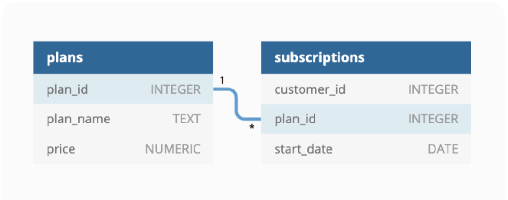
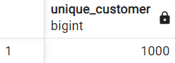
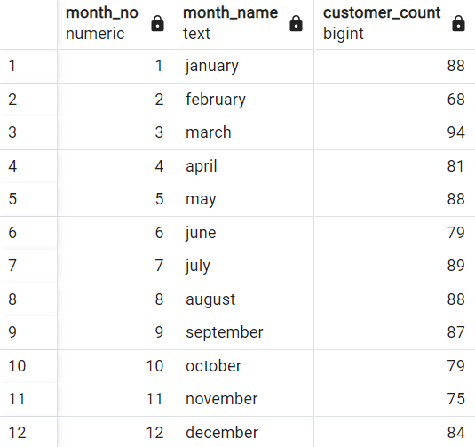
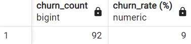
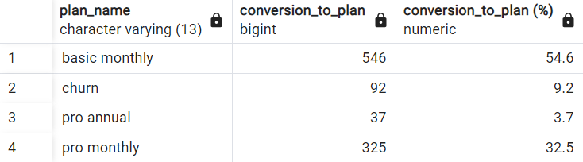
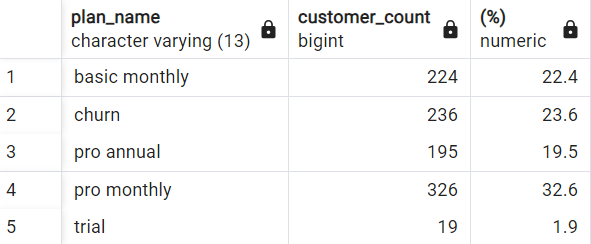
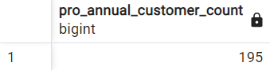
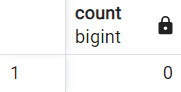

# Foodie-Fi
 _Challenge #3 from 8 Week SQL Challenge_ 

# 1. Introdução

 Esse projeto é o terceiro desafio do programa 8 Week SQL Challenge do Data With Danny.

 O contexto está relacionado ao serviço de streaming, onde o negócio é focado em promover assinaturas que possibilitem o acesso dos seus clientes a programas de culinária. Seria como os streamings que temos hoje, mas apenas para programas relacionados a comida.

 Assim, o estudo se concentra no uso de dados digitais de estilo de assinatura para responder a importantes questões do negócio, as quais serão tratadas adiante.

# 2. Estrutura dos dados

O dataset é composto por duas tabelas, e o Diagrama Entidade-Relacionamento está apresentado abaixo.



Tabela 1 - Plans

A tabela "Plans" apresenta os tipos de planos disponíveis e seus preços. O cliente pode escolher entre os planos mensal básico (basic monthly), mensal pro (pro monthly) ou anual pro (pro annual). Também podem fazer um teste grátis inicial por 7 dias (trial), continuando automaticamente com o plano de assinatura mensal pro, a não ser que façam o cancelamento (churn).

| Atributos |	Descrição |
| --------- | --------- |
| plan_id | id do plano |
| plan_name | nome do plano |
| price | preço do plano |

Tabela 2 - Subscriptions

A tabela "Subscriptions" apresenta as assinaturas feitas pelos clientes, de acordo com o tipo de plano e data de início da utilização.

| Atributos |	Descrição |
| --------- | --------- |
| customer_id | id do cliente |
| plan_id | id do plano utilizado |
| start_date | data de início de uso do plano |

# 3. Estudos

Este estudo é dividido em duas etapas. A primeira diz respeito a uma compreensão geral dos dados para que posteriormente sejam feitas as análises requeridas, na segunda etapa.

## 3.1. Jornada do cliente

Nessa etapa o objetivo é avaliar como acontecem as jornadas dos clientes dentro da plataforma de streaming em relação às assinaturas. Aqui apresentarei 4 amostras, apenas para podermos dar uma olhada geral e entender o funcionamento da migração das assinaturas.

Query:

```sql
select 
	s.customer_id,
	s.plan_id,
	p.plan_name,
	s.start_date
from subscriptions as s
left join plans as p
	on s.plan_id = p.plan_id
where s.customer_id in (1, 2, 3, 4);
```

Resposta: 


Por meio da consulta, temos que:

Cliente 1 assinou o plano mensal básico após o término do período de teste grátis.

Cliente 2 assinou o plano pro anual após o término do período de teste grátis.

Cliente 3 assinou o plano mensal básico após o término do período de teste grátis.

Cliente 4 assinou o plano mensal básico após o término do período de teste grátis e, quase 3 meses depois, cancelou.

## 3.2. Análise de Dados

**1. Quantos clientes o Foodie-Fi já teve?**

Query:

```sql
select count(distinct customer_id) as unique_customer
from subscriptions;
```

Resultado:



Foodie-Fi já teve 1000 clientes.

**2. Qual é a distribuição mensal do plano de teste grátis (trial) para nosso conjunto de dados?**

Query:

```sql
select 
	extract('month' from start_date) as month_no,
	lower(to_char(start_date, 'month')) as month_name,
	count(*) as customer_count
from subscriptions
where plan_id = 0
group by month_no, month_name
order by month_no;
```

Resultado:



Esses são os resultados, por mês, do número de clientes que utilizaram o teste grátis. Março é o mês com maior captação de clientes, enquanto Fevereiro se apresenta como o pior mês.

**3. Qual a distribuição dos planos para valores de start_date após 2020? (2020 não incluso) **

Query:

```sql
select 
	p.plan_name,
	count(*)
from subscriptions as s
left join plans as p
	on s.plan_id = p.plan_id
where ((extract('y' from start_date)) > 2020)
group by p.plan_name
order by count(*) desc;
```

Resultado:


Podemos ver que não existem clientes novos que aderiram ao período de teste grátis após 2020. Ainda, houve 71 cancelamentos, o que representa 35% do total de planos.

**4. Qual a quantidade e porcentagem de clientes que fizeram o cancelamento do plano?**

Query: 

```sql
select 
	count(case when p.plan_name = 'churn' then 1 end) as churns,
	count(case when p.plan_name = 'churn' then 1 end)::float/count(distinct s.customer_id) * 100 as "churn_rate (%)"
from subscriptions as s
left join plans as p
	on s.plan_id = p.plan_id;
```

Resultado:


307 clientes fizeram cancelamento, resultando em uma taxa de cancelamento de 30,7%.

**5. Quantos clientes cancelaram logo após o teste grátis?**

Query:

```sql
with 
ranking as (
	select 
	*, 
	rank() over(partition by customer_id order by start_date) 
	from subscriptions as s
	left join plans as p
	on s.plan_id = p.plan_id
	
)
select 
	count(case when rank=2 and plan_name = 'churn' then 1 end) as churn_count,
	round(count(case when rank=2 and plan_name = 'churn' then 1 end)::numeric/count(distinct customer_id) * 100) as "churn_rate (%)"
from ranking;
```

Aqui foi necessário fazer uma subquery, fazendo a ordenação das assinaturas feitas por cada cliente por meio da data de início (start_date), da mais antiga para a mais recente. Estamos interessados nos clientes que tem no rank 2 o cancelamento (churn), o que significa que, após o teste grátis (rank 1), esses clientes não prosseguiram com a assinatura de nenhum plano.

Resultado:



92 clientes cancelaram logo após o teste grátis, ou aproximadamente 9% do total de clientes.

**6. Qual a quantidade e porcentagem de planos após o teste grátis?**

Query:

```sql
with 
ranking as (
	select 
	*, 
	rank() over(partition by customer_id order by start_date) 
	from subscriptions as s
	left join plans as p
	on s.plan_id = p.plan_id
	
)
select 
	plan_name,
	count(plan_name) as conversion_to_plan,
	round(count(plan_name)::numeric/(select count(plan_name) from ranking where rank=2) * 100, 1) as "conversion_to_plan (%)"
from ranking
where rank = 2
group by plan_name
order by plan_name;
```

Nesse caso também foi utilizada uma subquery, também ordenando as assinaturas pelas datas de início (start_date). Dessa vez, queremos ter uma visão geral das atitudes dos clientes após o teste grátis.

Resultado:



Pelo resultado da consulta podemos ver que mais da metade dos clientes (54,6%) aderiu ao plano mensal básico (basic monthly), enquanto apenas 3,7% aderiu ao plano mais completo, o anual pro (pro annual). Ainda, mais de 90% dos clientes adere a algum plano depois do período de teste.

**7. Qual é a quantidade de clientes e o detalhamento percentual de todos os cinco planos em 31/12/2020?**

Query:

```sql
with 
ranking as (
	select 
	*, 
	rank() over(partition by customer_id order by start_date desc) 
	from subscriptions as s
	left join plans as p
	on s.plan_id = p.plan_id
	where start_date <= '2020-12-31'
)
select
	plan_name,
	count(plan_name) as customer_count,
	round(count(plan_name)::numeric/(select count(plan_name) from ranking where rank = 1) * 100, 1) as "(%)"
from ranking
where rank = 1
group by plan_name
order by plan_name;
```

Utilizando também uma subquery, realizei a ordenação decrescente das assinaturas até 31-12-2020, para analisar com qual plano os clientes finalizaram o ano de 2020.

Resultado:



A maior parte dos clientes finalizou o ano de 2020 no plano anual pro (pro annual, representando 32,6% do total de clientes.

É interessante observar que os clientes que foram para o plano mensal básico (basic monthly) após o período de teste migraram para algum plano pro ou cancelaram. 

A taxa de cancelamento é preocupante, pois saltou de cerca de 9% para mais de 23% até o final de 2020.

**8. Quantos clientes fizeram um upgrade para o plano anual pro (annual pro) em 2020?**

Query:

```sql
select 
	count(*) as pro_annual_customer_count
from subscriptions as s
left join plans as p
	on s.plan_id = p.plan_id
where (start_date between '2020-01-01'  and '2020-12-31') and plan_name = 'pro annual';
```

Resultado:



195 clientes fizeram upgrade para o plano anual pro em 2020.

**9. Quantos dias leva, em média, para um cliente aderir ao plano anual pro após o teste grátis?**

Query:

```sql
select
	round(avg(s2.start_date - s1.start_date)) as avg_days
from subscriptions as s1
join subscriptions as s2
	on s1.customer_id = s2.customer_id
	and s1.plan_id + 3 = s2.plan_id
where s2.plan_id = 3
```

Resultado:


Leva 105 dias, em média, para um cliente aderir ao plano anual pro após o período de teste grátis.

**10. Quantos clientes fizeram um downgrade de um plano mensal pro para um plano mensal básico em 2020?**

Query:

```sql
select count(*)
from subscriptions as s1
join subscriptions as s2
	on s1.customer_id = s2.customer_id
	and s1.plan_id - 1 = s2.plan_id
where s2.plan_id = 1
	and s2.start_date - s1.start_date > 0
	and s2.start_date between '2020-01-01' and '2020-12-31'
```

Resultado:



Em 2020 nenhum cliente fez downgrade do plano mensal pro para o plano mensal básico.

## 3.3. Questões abertas do negócio

**1. Como você calcularia a taxa de crescimento do Foodie-Fi?**

Eu focaria principalmente na taxa de crescimento anual com base na receita e com base no número de clientes, para poder avaliar a escalabilidade da empresa.

O cálculo para a taxa de crescimento anual com base na receita se dá por meio da fórmula:

Taxa de crescimento = ((receita 2021 - receita 2020) / receita 2020) * 100

Enqunto o cálculo para a taxa de crescimento anual com base no número de clientes se dá pela fórmula:

Taxa de crescimento = ((contagem de clientes 2021 - contagem de clientes 2020) / contagem de clientes 2020) * 100

**2. Quais métricas principais você recomendaria que o gerenciamento da Foodie-Fi monitorasse ao longo do tempo para avaliar o desempenho de seus negócios em geral?**

Há algumas formas de calcular a taxa de crescimento dessa empresa. Entre os indicadores, estão: 

- Taxa de crescimento mensal: comparação do quanto a empresa faturou de um mês para outro.

- Custo de aquisição de clientes (CAC): valor que uma empresa gasta para adquirir novos clientes.

- Churn rate: esse indicador representa a evasão de clientes de uma empresa, isto é, o número de clientes finais que cancelam o serviço/produto recebido.

- Taxa de conversão de vendas: esta é uma boa métrica a acompanhar porque pode gerar percepções tanto para as equipes de vendas quanto para as de marketing em relação ao público-alvo. Uma taxa de conversão alta é um sinal de que o foco está no público correto e que a equipe está se concentrando nas prioridades adequadas. Taxas de conversão baixas indicam que os clientes potenciais são perdidos em algum ponto do funil de vendas.

- Net Promoter Score (NPS): esta métrica é uma das medidas mais comuns da lealdade e da satisfação dos clientes, sendo às vezes chamada de pontuação de satisfação do cliente. Ao pedir aos clientes que avaliem a probabilidade de recomendar o Foodie-Fi a outras pessoas, a gestão pode avaliar a satisfação geral do cliente e identificar áreas de melhoria.

- O retorno sobre o investimento (ROI): este indicador permite saber quanto dinheiro a empresa ganhou ou perdeu com os investimentos feitos, sabendo, assim, quais investimentos valeram a pena ou não. Ele permite avaliar quais iniciativas contribuem para o resultado da empresa.


**3. Quais são algumas das principais jornadas ou experiências do cliente que você analisaria mais detalhadamente para melhorar a retenção de clientes?**

As principais jornadas ou experiências do cliente que eu analisaria mais detalhadamente para melhorar a retenção de clientes são: 

- Envolvimento do cliente com o conteúdo: compreender quais programas e receitas são mais populares e com que frequência os clientes os assistem pode ajudar a melhorar a seleção e recomendações de conteúdo. 

- Feedback do cliente: solicitar feedback do cliente por meio de pesquisas, análises e interações de suporte ao cliente pode fornecer insights valiosos sobre áreas que precisam de melhorias ou recursos que podem ser adicionados. Ainda que não seja um indicador quantitativo, é uma excelente forma de buscar compreender o cliente.

- Churn rate: entender por que os clientes estão deixando o serviço pode ajudar a empresa a resolver os problemas subjacentes que estão causando a rotatividade. 


**4. Se a equipe do Foodie-Fi criasse uma pesquisa de saída mostrada aos clientes que desejam cancelar sua assinatura, quais perguntas você incluiria na pesquisa?**

Incluiria perguntas sobre qual o motivo que levou ao cancelamento, buscando entender, por exemplo, se o problema está no produto em si (os programas não são interessantes ou são muito ruins) ou na prestação do serviço (a plataforma é lenta, o custo é muito alto, existem plataformas melhores). Assim, algumas perguntas que eu incluiria são:

- Por que você está cancelando sua assinatura?
- Quão satisfeito você ficou com o conteúdo oferecido?
- Como foi sua experiência com a navegabilidade da plataforma?
- Você achou a recomendação de conteúdo relevante e personalizada de acordo com seus interesses?
- Você teve algum problema com o suporte ao cliente durante sua assinatura?
- Qual é a probabilidade de você recomendar o Foodie-Fi a um amigo ou membro da família?

**5. Quais alavancas de negócios a equipe Foodie-Fi poderia usar para reduzir a taxa de rotatividade de clientes? Como você validaria a eficácia de suas ideias?**

Por meio do monitoramento constante da jornada do cliente e do churn rate, além dos feedbacks recebidos, a empresa poderia utilizar o upsell, por exemplo, para que o cliente optasse por um plano pro invés de um plano básico (nota-se que o plano mensal pro custa o dobro do plano básico). É importante também verificar se os programas ofertados na plataforma já estão sendo ofertados por outros streamings, pois isso poderia fazer com que o cliente perdesse o interesse. Outra alavanca seria a fidelização do cliente, questionar o que o cliente que permanece tem que os outros não tem, e tentar fazer com que ele permaneça, por meio de um atendimento de excelência, do lançamento de novos programas que façam sentido para esse usuário e de benefícios que ele não vai encontrar em outras plataformas.

Para validar a eficácia dessas ideias, o Foodie-Fi poderia implementar pesquisas com clientes para analisar o impacto dessas alavancas na retenção dos clientes. 

# 4. Conclusões

Esse estudo de caso reflete questões realistas nas quais normalmente se foca para as solicitações de análise relacionadas a produtos, em uma ampla variedade de setores, especialmente no espaço digital.

