# Data Bank
 _Challenge #4 from 8 Week SQL Challenge_

 # 1. Introdução

 Esse projeto é o quarto desafio do programa 8 Week SQL Challenge do Data With Danny.

 O Data Bank funciona como qualquer outro banco digital - mas não se destina apenas a atividades bancárias, ele também possui uma plataforma de armazenamento de dados distribuído. Os clientes recebem limites de armazenamento de dados em nuvem que estão diretamente ligados a quanto dinheiro eles têm em suas contas. O Data Bank deseja aumentar sua base total de clientes, mas também precisa de ajuda para monitorar a quantidade de armazenamento de dados que seus clientes precisarão.

Este estudo de caso trata de calcular métricas, crescimento e ajudar a empresa a analisar seus dados de maneira inteligente para melhor prever e planejar seus desenvolvimentos futuros.

# 2. Estrutura dos dados

O dataset é composto por três tabelas, e o Diagrama Entidade-Relacionamento está apresentado abaixo.

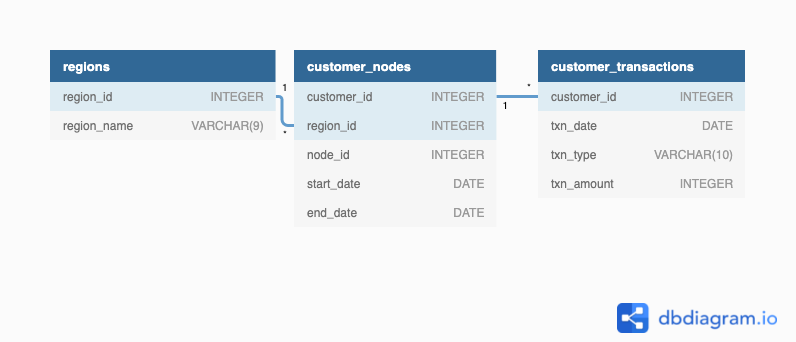

Tabela 1 - Regions

Assim como as plataformas populares de criptomoeda, o Data Bank também funciona em uma rede de nós onde dinheiro e dados são armazenados em todo o mundo. No sentido bancário tradicional é como se fossem agências bancárias ou lojas que existem em todo o mundo.

| Atributos |	Descrição |
| --------- | --------- |
| region_id | id da região |
| region_name | nome da região |

Tabela 2 - Customer Nodes

Os clientes são distribuídos aleatoriamente pelos nós de acordo com sua região – isso também especifica exatamente qual nó contém seu dinheiro e seus dados. Esta distribuição aleatória muda frequentemente para reduzir o risco de hackers entrarem no sistema do Data Bank e roubarem dinheiro e dados dos clientes.

| Atributos |	Descrição |
| --------- | --------- |
| customer_id | id do cliente|
| region_id | id da região |
| node_id | id do nó |
| start_date | data de entrada no nó |
| end_date | data de saída do nó |

Tabela 3 - Customer Transactions

Esta tabela armazena todos os depósitos, saques e compras dos clientes realizados com o cartão de débito do Data Bank.

| Atributos |	Descrição |
| --------- | --------- |
| customer_id | id do cliente|
| txn_date | data da transação |
| txn_type | tipo da transação |
| txn_amount | quantidade de dinheiro movimentada na transação |

# 3. Estudos

Este estudo é dividido em três etapas.

## 3.1. Análise exploratória de nós dos clientes

**1. Quantos nós exclusivos existem no sistema de banco de dados?**

- Utilizar COUNT DISTINCT para contar o número de nós distintos.

Query:

```sql
select 
	count(distinct node_id) as unique_nodes
from customer_nodes;
```

Resultado:

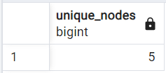

Existem 5 nós exclusivos no sistema de bancos de dados.

**2. Qual é o número de nós por região?**

- Utilizar COUNT para contar o número de nós por região e fazer um LEFT JOIN para unir a tabela customer_nodes com a tabela regions.

Query:

```sql
select
	n.region_id,
	region_name,
	count(node_id) as num_of_nodes
from customer_nodes as n
left join regions as r
	on n.region_id = r.region_id
group by n.region_id, region_name;
```

Resultado:

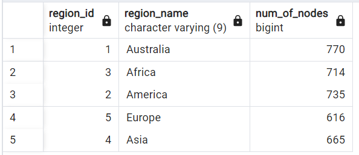

O número de nós por região varia entre 616 e 770, sendo a Austrália a região com mais nós.

**3. Quantos clientes estão alocados em cada região?**

- Utilizar COUNT DISTINCT para contar o número de clientes agrupados por região e fazer um LEFT JOIN para unir a tabela customer_nodes com a tabela regions.

Query:

```sql
select
	n.region_id,
	region_name,
	count(distinct customer_id) as num_of_customers
from customer_nodes as n
left join regions as r
	on n.region_id = r.region_id
group by n.region_id, region_name;
```

Resultado:

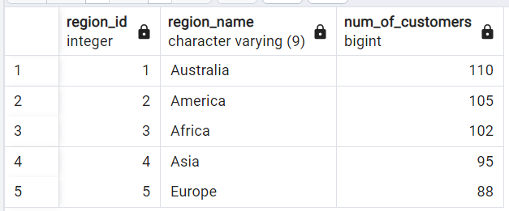

A Austrália é a região com o maior número de clientes alocados.

**4. Em quantos dias, em média, os clientes são realocados para um nó diferente?**

- Utilizar a função AVG para calcular o valor médio entre start_date e end_data. Filtrar utilizando WHERE para eliminar os valores de end_date que tem o ano '9999' pois é um valor anormal.

Query:

```sql
select
	avg(end_date - start_date) as avg_reallocation_days
from customer_nodes
where extract('y' from end_date) <> '9999';
```

Resultado:

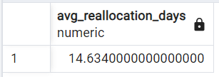

A cada quase 15 dias, em média, os clientes são realocados para um novo nó.

**5. Qual é a mediana, os percentis 80 e 95 para esta mesma métrica de dias de realocação para cada região?**

- Criar uma CTE com o comando WITH para calcular o tempo de realocação em dias;

- Utilizar PERCENTILE_CONT e WITHIN GROUP para calcular os percentis.

Query:

```sql
with
cte as (
	select
		customer_id,
		n.region_id,
		region_name,
		(end_date - start_date) as reallocation_days
	from customer_nodes as n
	left join regions as r
		on n.region_id = r.region_id
	where extract('y' from end_date) <> '9999'
)

select
	region_id,
	region_name,
	percentile_cont(0.5) within group (order by reallocation_days) as median,
	percentile_cont(0.8) within group (order by reallocation_days) as "80th_percentil",
	percentile_cont(0.95) within group (order by reallocation_days) as "95th_percentil"
from cte
group by region_id, region_name
order by region_id;
```

Resultado:

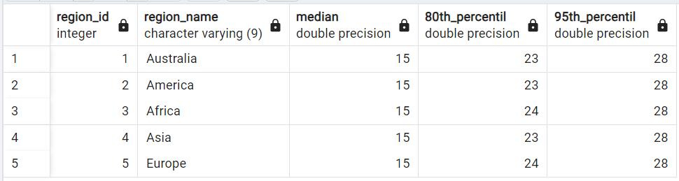

O resultado mostra que todas as regiões têm a mesma mediana e o percentil 95 para a mesma métrica de dias de realocação, o que muda entre elas é o percentil 80, sendo que Áfria e Europa apresentem 24 dias enquanto Austrália, Ásia e América apresentam 23 dias.

## 3.2. Trasações dos clientes

**1. Qual é a contagem exclusiva e o valor total para cada tipo de transação?**

- Utilizar COUNT para contar o número de transações e SUM para somar a quantia total de cada transação.

Query: 

```sql
select
	txn_type,
	count(txn_type) as num_of_transactions,
	sum(txn_amount) as total_amount
from customer_transactions
group by txn_type;
```

Resultado:

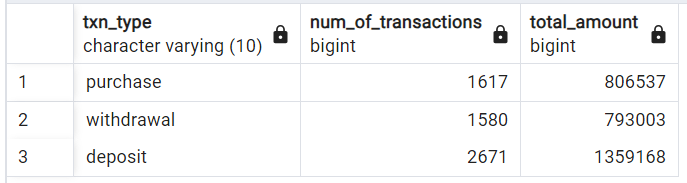

O tipo de transação “Depósito” apresenta a maior contagem, com um total de 2.671 ocorrências e um valor acumulado de 1.359.168. Na sequência está o tipo de transação “Compra”, que foi registrada 1.617 vezes, com um valor total de 806.537. Por outro lado, “Saque” tem a contagem mais baixa, com 1.580 ocorrências e um valor total de 793.003.

**2. Qual é a média total histórica de contagens e valores de depósitos para todos os clientes?**

- Criar uma CTE com o comando WITH para contar o número de transações do tipo depósito e a soma desses valores para cada cliente;

- Utilizar o comando AVG para calcular a média da contagem e a média da soma total das transações do tipo depósito.

Query:

```sql
with 
cte as (
	select
		customer_id,
		txn_type,
		count(txn_type) as num_of_deposits,
		sum(txn_amount) as total_amount
	from customer_transactions
	where txn_type = 'deposit'
	group by customer_id, txn_type
	order by customer_id
)
select
	txn_type,
	round(avg(num_of_deposits), 2) as avg_deposit_count,
	round(avg(total_amount), 2) as avg_deposit_amount
from cte
group by txn_type;
```

Resultado:

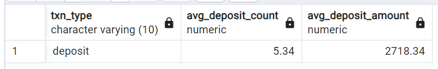

A contagem média histórica de depósitos é de 5,34, enquanto o valor médio depositado é de 2.718,34.

**3. Para cada mês - quantos clientes do Data Bank fazem mais de 1 depósito e 1 compra ou 1 saque em um único mês?**

- Criar uma CTE com o comando WITH que conta o número de vezes que cada tipo de transação ocorre, agrupadas por mês;

- Escrever uma consulta que filtre a CTE para incluir apenas os registros onde a contagem de “depósito” seja maior que 1 e a contagem de “compra” ou a contagem de “retirada” seja maior que 0.

Query:

```sql
with
customer_activity as (
	select
		customer_id,
		extract ('month' from txn_date) as month_id,
		to_char(txn_date, 'month') as month_name,
		count(case when txn_type = 'deposit' then 1 end) as deposit_count,
		count(case when txn_type = 'purchase' then 1 end) as purchase_count,
		count(case when txn_type = 'withdrawal' then 1 end) as withdrawal_count
	from customer_transactions
	group by customer_id, month_id, month_name
)
select
	month_id,
	month_name,
	count(*)
from customer_activity	
where deposit_count > 1 and (purchase_count > 0 or withdrawal_count > 0)
group by month_id, month_name
order by month_id;
```

Resultado:


Março é o mês que apresenta a maior quantidade de clientes que fizeram 1 depósito e 1 saque ou 1 compra, registrando 192 clientes, enquanto Abril teve o menor número de clientes nessas mesmas condições, registrando um total de 70 clientes.

**4. Qual é o saldo final de cada cliente no final do mês?**

- Criar uma CTE com o comando WITH que soma o valor total de cada tipo de transação para cada cliente e retorna, também, a soma total entre essas transações, por mês;

- Utilizar a função SUM com a cláusula OVER para calcular o total acumulado da coluna closing_amount para cada cliente, particionado pelo ID do cliente e ordenado pelo início do mês. Este total corrente fornece o saldo final de cada cliente no final do mês.

Query:

```sql
with
monthly_transactions as (
	select
			customer_id,
			extract ('month' from txn_date) as month_id,
			to_char(txn_date, 'month') as month_name,
			sum(case when txn_type = 'deposit' then txn_amount end) as deposit_amount,
			sum(case when txn_type = 'purchase' then txn_amount end) as purchase_amount,
			sum(case when txn_type = 'withdrawal' then txn_amount end) as withdrawal_amount,
			sum(case when txn_type = 'deposit' then txn_amount else -txn_amount end) as closing_amount
	from customer_transactions
	group by customer_id, month_id, month_name
	order by customer_id, month_id
)
select
	customer_id,
	month_id,
	month_name,
	sum(closing_amount) over(partition by customer_id order by month_id) as closing_balance
from monthly_transactions;
```

Resultado:

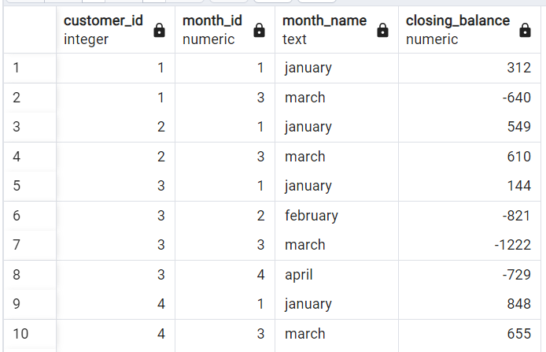


_NOTA: Nem todas as saídas são exibidas, considerando o alto número de resultados, portanto apenas os 4 primeiros clientes estão exibidos nessa documentação._

**5. Qual é a porcentagem de clientes que aumentaram seu saldo final em mais de 5%?**

- Criar uma CTE (monthly_transactions) com o comando WITH que soma o valor total de cada tipo de transação para cada cliente e retorna, também, a soma total entre essas transações, por mês;

- Criar outra CTE (percentage_increase) para calcular o aumento percentual no saldo final de cada cliente em relação ao mês anterior, utilizando LAG com a cláusula OVER particionado pelo ID do cliente e ordenado pelo mês;

- Usar a CTE o percentage_increase na consulta final para calcular a porcentagem de clientes cujo saldo final aumentou mais de 5% em relação ao mês anterior. Isso é feito contando o número de clientes distintos cujo percentage_increase é maior que 5 e dividindo esse valor pelo número total de clientes distintos.

Query:

```sql
with
monthly_transactions as (
	select
			customer_id,
			extract ('month' from txn_date) as month_id,
			to_char(txn_date, 'month') as month_name,
			sum(case when txn_type = 'deposit' then txn_amount end) as deposit_amount,
			sum(case when txn_type = 'purchase' then txn_amount end) as purchase_amount,
			sum(case when txn_type = 'withdrawal' then txn_amount end) as withdrawal_amount,
			sum(case when txn_type = 'deposit' then txn_amount else -txn_amount end) as closing_amount
	from customer_transactions
	group by customer_id, month_id, month_name
	order by customer_id, month_id
),
percentage_increase as (
	select
		customer_id,
		month_id,
		closing_amount,
		lag(closing_amount) over (partition by customer_id order by month_id),
		100 * (closing_amount - lag(closing_amount) over (partition by customer_id order by month_id)) / nullif(lag(closing_amount) over (partition by customer_id order by month_id), 0) as percentage_increase
	from monthly_transactions
)
select
	100 * count(distinct customer_id) / (select count(distinct customer_id) from customer_transactions)::float as percentage_customer
from percentage_increase
where percentage_increase > 5;
```

Resultado:

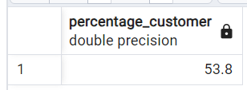

53,8% dos clientes aumentaram seu saldo final em mais do que 5%.

# 3.3. Desafio de alocação de dados

Nesse desafio, o objetivo é testar algumas hipóteses diferentes. A equipe do Data Bank deseja realizar um experimento em que diferentes grupos de clientes receberiam dados usando 3 opções diferentes:

- Opção 1: os dados são alocados com base na quantidade de dinheiro no final do mês anterior

- Opção 2: os dados são alocados sobre o valor médio de dinheiro mantido na conta nos 30 dias anteriores

- Opção 3: os dados são atualizados em tempo real

Foi solicitado que fossem gerados os seguintes elementos de dados para ajudar a equipe do Data Bank a estimar quantos dados precisarão ser provisionados para cada opção:

- Coluna de saldo do cliente em execução que inclui o impacto de cada transação;

- Saldo do cliente no final de cada mês;

- Valores mínimo, médio e máximo do saldo corrente para cada cliente.

Usando todos os dados disponíveis, quantos dados seriam necessários para cada opção mensalmente?

**1. Coluna de saldo do cliente em execução que inclui o impacto de cada transação**

- Criar uma CTE que elenque os valores das transações de cada cliente, considerando positivas as transações de depósito e negativas as transações de saques e compras;

- Utilizar SUM com a cláusula OVER e ROWS BETWEEN UNBOUDED PRECEDING AND CURRENT ROW para encontrar o saldo do cliente em execução considerando o saldo do dia dia anterior.

Query:

```sql
with transactions as (
	select
		customer_id,
		txn_date,
		case
			when txn_type = 'deposit' then txn_amount else -txn_amount end as amount
	from customer_transactions
	order by customer_id, txn_date
)
select
	customer_id,
	txn_date,
	sum(amount) over (partition by customer_id order by txn_date rows between unbounded preceding and current row) as running_balance 
from transactions;
```

Resultado:

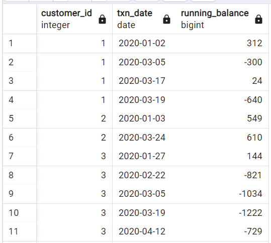

_NOTA: Nem todas as saídas são exibidas, considerando o alto número de resultados._

**2. Saldo do cliente no final de cada mês**

- Criar uma CTE (monthly_transactions) com o comando WITH que soma o valor total de cada tipo de transação para cada cliente e retorna, também, a soma total entre essas transações, por mês;

- Utilizar a função SUM com a cláusula OVER para calcular o total acumulado da coluna closing_amount para cada cliente, particionado pelo ID do cliente e ordenado pelo início do mês. Este total corrente fornece o saldo final de cada cliente no final do mês.

Query:

```sql
with
monthly_transactions as (
	select
			customer_id,
			extract ('month' from txn_date) as month_id,
			to_char(txn_date, 'month') as month_name,
			sum(case when txn_type = 'deposit' then txn_amount end) as deposit_amount,
			sum(case when txn_type = 'purchase' then txn_amount end) as purchase_amount,
			sum(case when txn_type = 'withdrawal' then txn_amount end) as withdrawal_amount,
			sum(case when txn_type = 'deposit' then txn_amount else -txn_amount end) as closing_amount
	from customer_transactions
	group by customer_id, month_id, month_name
	order by customer_id, month_id
)
select
	customer_id,
	month_id,
	month_name,
	closing_amount as closing_balance
from monthly_transactions;
```

Resultado:

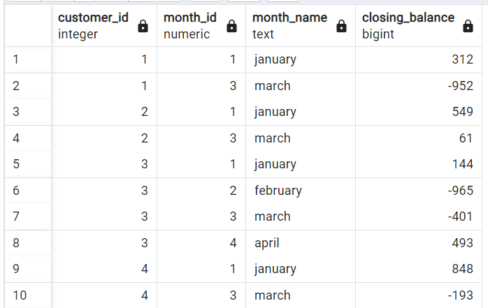

_NOTA: Nem todas as saídas são exibidas, considerando o alto número de resultados._

**3. Valores mínimo, médio e máximo do saldo corrente para cada cliente**

- Criar uma CTE que reflita o efeito de cada transação e o saldo corrente após cada uma delas;

- Utilizar as funções MIN, AVG e MAX para encontrar os valores mínimo, médio e máximo do saldo corrente para cada cliente.

Query:

```sql
with transactions as (
	select
		customer_id,
		txn_date,
		sum(case
			when txn_type = 'deposit' then txn_amount else -txn_amount end) over (partition by customer_id order by txn_date rows between unbounded preceding and current row) as running_balance 
	from customer_transactions
	order by customer_id, txn_date
)
select
	customer_id,
	min(running_balance),
	avg(running_balance),
	max(running_balance)
from transactions
group by customer_id;
```

Resultado:

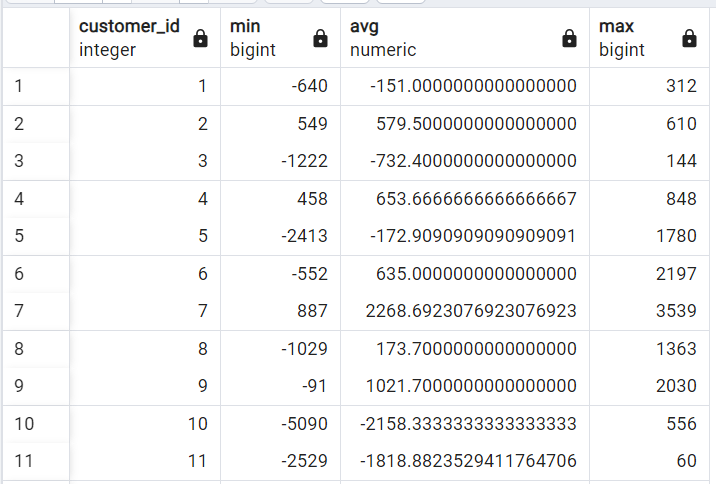

_NOTA: Nem todas as saídas são exibidas, considerando o alto número de resultados._

***

**Opção 1: os dados são alocados com base na quantidade de dinheiro no final do mês anterior**

Query:
```sql
with
monthly_transactions as (
	select
			customer_id,
			extract ('month' from txn_date) as month_id,
			to_char(txn_date, 'month') as month_name,
			sum(case when txn_type = 'deposit' then txn_amount end) as deposit_amount,
			sum(case when txn_type = 'purchase' then txn_amount end) as purchase_amount,
			sum(case when txn_type = 'withdrawal' then txn_amount end) as withdrawal_amount,
			sum(case when txn_type = 'deposit' then txn_amount else -txn_amount end) as amount
	from customer_transactions
	group by customer_id, month_id, month_name
	order by customer_id, month_id
),
running_balance as (
	select
		customer_id,
		month_id,
		month_name,
		sum(amount) over (partition by customer_id order by customer_id, month_id rows between unbounded preceding and current row) as running_balance
	from monthly_transactions
),
monthly_allocation as (
	select
		customer_id,
		month_id,
		month_name,
		lag(running_balance) over (partition by customer_id order by customer_id, month_id) as monthly_allocation
	from running_balance	
)
select
	month_id,
	month_name,
	sum(case when monthly_allocation < 0 then 0 else monthly_allocation end) as total_allocation
from monthly_allocation
group by month_id, month_name
order by month_id
```

Resultado:

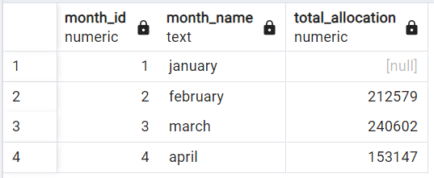

Nota-se que o mês de Janeiro não possui alocação de dados pois não há registros de movimentação no mês anterior, que seria Dezembro. Março é o mês com a maior quantidade de dados alocados.

**Opção 2: os dados são alocados sobre o valor médio de dinheiro mantido na conta nos 30 dias anteriores**

Query:

```sql
with running_balance as (
	select
		customer_id,
		extract ('month' from txn_date) as month_id,
		to_char(txn_date, 'month') as month_name,
		sum(case
			when txn_type = 'deposit' then txn_amount else -txn_amount end) over (partition by customer_id order by txn_date rows between unbounded preceding and current row) as running_balance 
	from customer_transactions
	order by customer_id, txn_date
),
avg_running_balance as (
	select
		customer_id,
		month_id,
		month_name,
		avg(running_balance) as avg_balance
	from running_balance
	group by customer_id, month_id, month_name
	order by customer_id, month_id
)
select
	month_id,
	month_name,
	round(sum(case when avg_balance < 0 then 0 else avg_balance end), 2) as total_allocation
from avg_running_balance
group by month_id, month_name
order by month_id
```

Resultado:

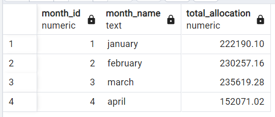

Utilizando a segunda opção, o mês de Março continua sendo o mês com a maior quantidade de dados alocados.

**Opção 3: os dados são atualizados em tempo real**

Query:

```sql
with
monthly_transactions as (
	select
			customer_id,
			extract ('month' from txn_date) as month_id,
			to_char(txn_date, 'month') as month_name,
			sum(case when txn_type = 'deposit' then txn_amount end) as deposit_amount,
			sum(case when txn_type = 'purchase' then txn_amount end) as purchase_amount,
			sum(case when txn_type = 'withdrawal' then txn_amount end) as withdrawal_amount,
			sum(case when txn_type = 'deposit' then txn_amount else -txn_amount end) as amount
	from customer_transactions
	group by customer_id, month_id, month_name
	order by customer_id, month_id
),
running_balance as (
	select
		customer_id,
		month_id,
		month_name,
		sum(amount) over (partition by customer_id order by customer_id, month_id rows between unbounded preceding and current row) as running_balance
	from monthly_transactions
)
select
	month_id,
	month_name,
	sum(case when running_balance < 0 then 0 else running_balance end) as total_amount
from running_balance
group by month_id, month_name
order by month_id
```

Resultado:

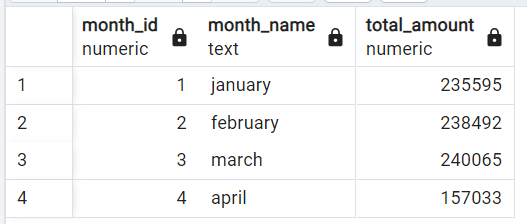

Na opção 3, o mês de Março ainda é o que apresenta a maior quantidade de dados alocados.

# 4. Conclusões

- Existem 5 nós distintos no sistema de banco de dados;

- Entre as regiões, a Austrália tem a maior contagem de alocação de clientes, 110, seguida pela América, com 105, enquanto a Europa tem a contagem mais baixa, 88;

- Leva em média 15 dias para que os clientes sejam realocados para um nó diferente;

- Em relação aos tipos de transações bancárias, depósitos (deposit) tem a maior contagem, 2.671, e um valor acumulado de 1.359.168. Em seguida está a transação do tipo compra (purchase), registrada 1.617 vezes com um valor acumulado de 806.537. Por último está a transação de saque (withdrawal), registrada 1.580 vezes com um valor acumulado de 793.003.

- Para as hipóteses de alocação de dados baseadas nas três opções dadas:
    -  na Opção 1, que aloca dados de acordo com a quantidade de dinheiro no mês anterior, há uma problemática em relação ao mês de Janeiro, pois não há registros de movimentação bancária no mês anterior, que seria Dezembro do ano anterior. 
    - na Opção 2 e na Opção 3, Março se destaca como o mês com a maior quantidade de dados alocados enquanto Abril mostra uma queda relativamente acentuada em comparação aos outros meses.